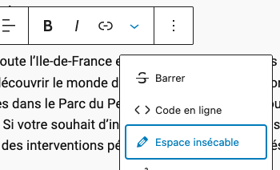

# Ajoute un choix "Espace insécable" dans le sélecteur de la toolbar de Gutengerg - Wordpress

Clone juste ce repo dans le dossier plugins de ton WP. Active le plugin.  
Une fois le plugin activé, dans tes pages et posts, si tu édites un texte, tu auras la possibilité d'insérer un espace insécable.  

